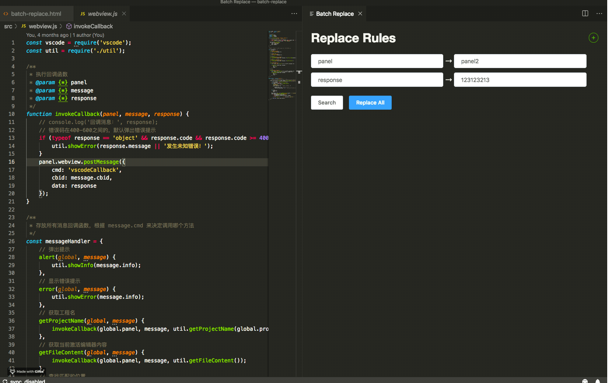

## BATCH-REPLACE

这是一个帮助开发者在 VS Code 中对文档进行多词批量操作的插件

✔ 支持填入多词 
✔ 支持批量替换 
✔ 项目开源 

## 安装：

浏览器输入：`vscode:extension/raindrop.batch-replace`，点击「打开 Visual Studio Code」到插件介绍页面 `install` 插件

## 使用：

`Cmd+ f9` 唤起插件

`Ctrl + Shift + P` 或 `Cmd + Shift + P` 并键入“Batch Replace”，从命令面板中运行命令唤起插件

